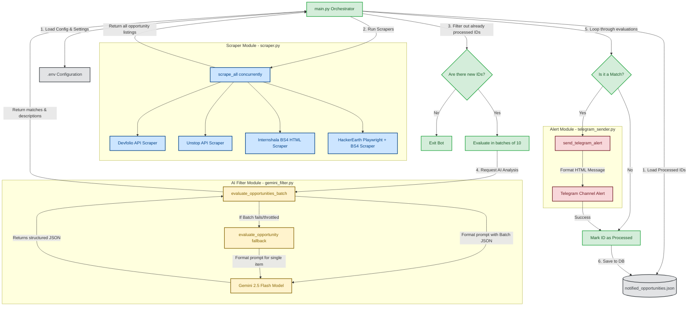

# System Architecture & Workings - HackAlert Bot

This document explains the internal workings, component architecture, and data flow of the HackAlert Bot. It is designed to help anyone understand how the bot scrapes, filters, and alerts new opportunities.

---

## 1. System Architecture Diagram

The diagram below visualizes the system components and the sequence of data flow during a single execution run (you can also view the raw source in [diagram.mermaid](file:///d:/New%20project%20-%20Bot/diagram.mermaid)):

---

## 2. Component Breakdown

The HackAlert Bot consists of four primary components coordinated by a central orchestrator:

### A. Orchestrator (`main.py`)
This is the entry point of the application. Its responsibilities include:
- **State Management:** Reading and writing processed opportunity IDs to `notified_opportunities.json` to prevent duplicate alerts.
- **Cold Start Handling:** On the first execution, it seeds all scraped listings into the database silently so the bot doesn't spam historical opportunities.
- **Execution Orchestration:** Coordinating scraping, filtering, evaluation, notification delivery, and rate-limiting delays.
- **Error Fallback:** Handling batch failure by degrading gracefully to single-item analysis.

### B. Scraper Module (`scraper.py`)
This module aggregates opportunities from multiple platforms. It maximizes speed by running scrapers in parallel using a Python `ThreadPoolExecutor`.
- **Devfolio:** Fetches live hackathons via Devfolio's public JSON API.
- **Unstop:** Fetches hackathons via Unstop's public API.
- **Internshala:** Scrapes internships from Internshala using `BeautifulSoup4` to parse direct HTML.
- **HackerEarth:** Scrapes active challenges. Since HackerEarth dynamically renders content via Javascript, it leverages `Playwright` to run a headless Chromium browser. To optimize performance and bandwidth, it intercepts requests and blocks unneeded assets (stylesheets, fonts, media, and images).

### C. Gemini AI Filter (`gemini_filter.py`)
This component uses Google's `gemini-2.5-flash` model to analyze scraped listings against a customized `STUDENT_PROFILE` loaded from `.env`.
- **Batch Evaluation:** Opportunities are packaged in batches of 10 and sent to Gemini in a single API call to reduce latency and save API quota.
- **Fallback Evaluation:** If the batch evaluation fails, the orchestrator falls back to sequential single-opportunity queries.
- **Structured Output:** System instructions force Gemini to return valid JSON containing matching status (`is_match`), confidence, cleaned title, company name, detailed summary, key requirements list, stipend/benefits details, event mode (Online/Offline with location details), registration deadline, and eligibility criteria.
- **Rate-Limit Resiliency:** Automatically catches API status code 429 errors and retries with exponential backoff delay.

### D. Telegram Sender (`telegram_sender.py`)
Formats and delivers match alerts.
- **HTML Formatting:** Converts structured details into a clean, stylized HTML telegram message containing emoji icons, key facts (including a dedicated requirements block, stipend/benefits info, and online/offline mode), and direct hyperlinks.
- **Character Escaping:** Automatically escapes potential HTML injection values from scraped inputs to avoid breaking Telegram's HTML parse mode.
- **Local Fallback Mode:** Logs message formats to the command line if Telegram credentials are not configured, enabling offline local testing.

---

## 3. Step-by-Step Data Flow

1. **Initialization:**
   - The bot starts. The orchestrator calls `load_dotenv()` to parse variables like `GEMINI_API_KEY`, `TELEGRAM_BOT_TOKEN`, and `STUDENT_PROFILE`.
   - It reads `notified_opportunities.json` into a set of processed IDs.

2. **Concurrent Scraping:**
   - The orchestrator calls `scrape_all()`.
   - Four thread pools launch simultaneously to retrieve listings from Devfolio, Unstop, Internshala, and HackerEarth.
   - A unified list of raw opportunities is constructed. Each item gets a unique ID prefixed by its platform (e.g., `unstop-12345`).

3. **Change Detection:**
   - The bot compares scraped IDs against the processed set. If the processed set is empty, it populates it with all current IDs and shuts down (preventing spam on the first run).
   - If it is not a first run, it isolates the new opportunity listings.

4. **Batch AI Filtering:**
   - The orchestrator splits new listings into batches of 10 (up to a maximum of 30 listings to respect safety quotas).
   - For each batch, it constructs a prompt containing the target student profile and the opportunity data, sending it to Gemini.
   - Gemini returns a JSON array containing the matching results.
   - If any listing matches the user's profile with high confidence (`is_match: true`), it proceeds to notification.

5. **Notification & Save State:**
   - The orchestrator receives matches and triggers `send_telegram_alert()`.
   - A message is formatted and posted to the Telegram channel.
   - Once posted successfully (or run locally in debug mode), the opportunity ID is added to the local database list.
   - A 2.5-second cooldown delay runs between consecutive alerts.
   - The updated database is saved to `notified_opportunities.json`.
